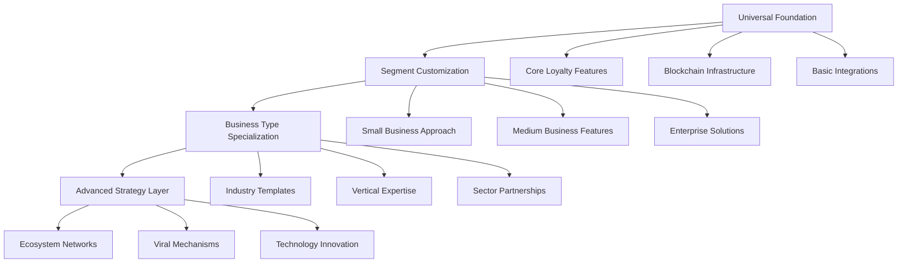

# Business Strategies & Market Penetration

## Executive Summary

This comprehensive guide consolidates all business adoption strategies, market penetration approaches, and industry-specific implementation guidance for the Ploy blockchain loyalty platform. The framework covers traditional business segment strategies, advanced viral growth mechanisms, and specialized approaches for different business types and industries.

## 🎯 Strategic Framework Overview

### Universal Adoption Principles

All successful loyalty platform adoptions share these core principles:

1. **Value Demonstration First** - Prove ROI before asking for commitment
2. **Complexity Reduction** - Hide technical complexity behind simple interfaces
3. **Risk Mitigation** - Reduce barriers to trial and adoption
4. **Success Alignment** - Align platform success with customer success
5. **Growth Enablement** - Support business growth with platform evolution

### Scalable Implementation Model



---

## 📱 Traditional Business Segment Strategies

### 1. Small Business Strategy (< $5M Revenue)

#### Core Approach: "Start Simple, Grow Smart"

**Universal Pricing Strategy:**
```typescript
interface UniversalPricing {
  pricing_principles: {
    value_alignment: "Price reflects customer value received",
    growth_enablement: "Lower barriers for smaller businesses",
    predictable_scaling: "Clear upgrade paths",
    success_sharing: "Reward achievement with benefits"
  },
  
  small_business_tier: {
    free_forever: {
      price: 0,
      customers: 1000,
      transactions: "5000/month",
      features: ["basic_points", "simple_rewards", "email_support"],
      setup_time: "30 minutes"
    },
    
    growth: {
      price: "$49-199/month",
      customers: "5000-25000",
      transactions: "50000-250000/month", 
      features: ["custom_branding", "basic_analytics", "chat_support"],
      setup_time: "2 hours"
    }
  }
}
```

**Key Implementation Features:**
- **Zero-Knowledge Blockchain**: Invisible wallet creation and management
- **Industry Templates**: Pre-built solutions for 50+ business types
- **One-Click Integrations**: POS systems, email marketing, social media
- **Progressive Web App**: No app store required, works on any device
- **Self-Service Onboarding**: Video tutorials and guided setup

**Distribution Channels:**
- Partner ecosystem (POS providers, business software)
- Local networks (Chambers of Commerce, SBA)
- Digital marketing (content, social media, SEO)
- Referral programs (customer-to-customer)

**Success Metrics:**
- Setup completion: 85% within 7 days
- First reward: 80% within 24 hours
- Monthly retention: 95%
- Business impact: 15-25% revenue increase

### 2. Medium Business Strategy ($5M-$50M Revenue)

#### Core Approach: "Scale with Confidence"

**Advanced Capabilities:**
```yaml
platform_features:
  analytics:
    - customer_segmentation: "AI-powered behavioral analysis"
    - predictive_modeling: "Churn prediction and prevention"
    - attribution_tracking: "Multi-touch campaign analysis"
    - real_time_dashboards: "Executive and operational views"
    
  integrations:
    - erp_systems: ['NetSuite', 'SAP_Business_One', 'Microsoft_Dynamics']
    - crm_platforms: ['Salesforce', 'HubSpot', 'Pipedrive']
    - marketing_tools: ['Marketo', 'Pardot', 'ActiveCampaign']
    - ecommerce: ['Magento', 'BigCommerce', 'Salesforce_Commerce']
    
  operations:
    - multi_location: "Centralized management, local customization"
    - franchise_support: "Distributed administration"
    - a_b_testing: "Campaign optimization"
    - workflow_automation: "Trigger-based actions"
```

**Implementation Timeline:**
- Week 1-2: Discovery and requirements gathering
- Week 3-4: Platform configuration and integration
- Week 5-6: Testing and user training
- Week 7-8: Pilot launch and optimization

### 3. Large Enterprise Strategy ($50M-$1B+ Revenue)

#### Core Approach: "Enterprise-Grade Innovation"

**Enterprise Architecture Options:**
```yaml
infrastructure_options:
  deployment:
    - public_cloud: "AWS/Azure/GCP dedicated instances"
    - private_cloud: "Isolated infrastructure"
    - hybrid: "Core on-premise, scale in cloud"
    - on_premise: "Complete data sovereignty"
    
  blockchain:
    - shared_nodes: "Cost-effective option"
    - dedicated_nodes: "Performance isolation"
    - private_chain: "Maximum control"
    - consortium: "Industry collaboration"
    
  security:
    - soc2_type2: "Security certification"
    - iso27001: "Information security management"
    - pci_dss: "Payment card industry compliance"
    - hipaa: "Healthcare information protection"
```

**Strategic Partnership Ecosystem:**
- **System Integrators**: Accenture, Deloitte, IBM (20-35% revenue share)
- **Cloud Providers**: AWS, Microsoft, Google (marketplace listings)
- **Enterprise Software**: Salesforce, SAP, Oracle (native integrations)

---

## 🏢 Business Type Specific Strategies

### SaaS & Technology Platforms Strategy

#### Hybrid Rewards Implementation
```typescript
interface SaaSStrategy {
  hybrid_rewards: {
    primary_track: {
      api_usage_milestones: "Points for integration depth",
      feature_adoption: "Rewards for platform mastery",
      community_contribution: "Developer advocacy bonuses",
      certification_achievements: "Professional development NFTs"
    },
    
    secondary_track: {
      subscription_multipliers: "Higher tiers earn more",
      usage_based_bonuses: "Volume discounts as points",
      referral_accelerators: "Compound rewards for advocates",
      retention_rewards: "Loyalty length bonuses"
    }
  },
  
  implementation_approach: {
    developer_focused: "API-first reward mechanisms",
    product_adoption: "Feature usage tracking and rewards",
    community_building: "Developer advocacy programs",
    revenue_alignment: "Subscription tier benefits"
  }
}
```

### E-commerce & Retail Strategy
```typescript
interface RetailStrategy {
  segment_approach: {
    small_business: {
      focus: "Point-of-sale integration",
      features: ["receipt_rewards", "social_sharing", "referral_programs"],
      timeline: "Same day activation",
      roi_expected: "20-30% customer retention boost"
    },
    
    medium_business: {
      focus: "Omnichannel experience", 
      features: ["unified_profiles", "inventory_integration", "campaign_automation"],
      timeline: "2-4 week implementation",
      roi_expected: "25-35% CLV increase"
    },
    
    enterprise: {
      focus: "Global brand management",
      features: ["multi_brand_support", "franchise_control", "advanced_personalization"],
      timeline: "3-6 month deployment",
      roi_expected: "8-12% same-store sales increase"
    }
  },
  
  hybrid_rewards: {
    action_based: ["social_shares", "reviews", "referrals", "app_engagement"],
    purchase_multipliers: ["tier_bonuses", "category_multipliers", "seasonal_boosts"]
  }
}
```

### Financial Services Strategy
```yaml
fintech_approach:
  compliance_by_segment:
    small_business:
      - basic_encryption
      - secure_storage
      - privacy_controls
      
    medium_business:
      - pci_compliance
      - audit_trails
      - data_governance
      
    enterprise:
      - full_regulatory_suite
      - global_compliance
      - regulatory_reporting
      - fraud_detection_ml

  hybrid_rewards:
    action_based:
      - financial_education_completion
      - budget_goal_achievements
      - security_feature_adoption
      - referral_activities
      
    transaction_multipliers:
      - account_balance_tiers
      - transaction_volume_bonuses
      - product_usage_multipliers
      - loyalty_tenure_rewards
```

### Web3/DeFi Strategy
```typescript
interface Web3DeFiStrategy {
  protocol_native_rewards: {
    primary_track: {
      liquidity_provision: "Points for DeFi protocol participation",
      governance_participation: "DAO voting and proposal rewards", 
      security_contributions: "Bug bounties and audit rewards",
      cross_chain_activities: "Multi-chain ecosystem participation"
    },
    
    secondary_track: {
      token_economy_multipliers: "Higher token holdings unlock better rates",
      nft_marketplace_bonuses: "Trading and creation volume rewards",
      staking_rewards: "Lock-up period and amount multipliers",
      yield_optimization: "Smart strategy and compound bonuses"
    }
  },
  
  ecosystem_integration: {
    defi_protocols: "Uniswap, Aave, Compound integration rewards",
    nft_marketplaces: "OpenSea, Foundation, SuperRare participation",
    dao_governance: "Cross-DAO voting and proposal management",
    bridge_networks: "Cross-chain asset transfer incentives"
  },
  
  risk_adjusted_rewards: {
    impermanent_loss_compensation: "Points to offset DeFi risks",
    security_auditing: "Enhanced rewards for security contributions",
    protocol_diversification: "Multi-protocol participation bonuses",
    market_volatility_buffers: "Stable rewards during market downturns"
  }
}
```

### Gaming & Entertainment Strategy
```yaml
gaming_strategy:
  hybrid_rewards:
    achievement_based:
      - tournament_victories
      - skill_milestones
      - community_contributions
      - content_creation
      
    spending_multipliers:
      - premium_account_bonuses
      - in_game_purchase_rewards
      - season_pass_benefits
      - cosmetic_acquisition_points

  cross_platform_assets:
    nft_integration: "Achievement NFTs with cross-game utility"
    tournament_rewards: "Blockchain-verified championship records"
    community_badges: "Social contribution recognition"
    rare_collectibles: "Limited edition digital assets"
```

### Healthcare & Wellness Strategy
```yaml
healthcare_strategy:
  privacy_framework:
    all_segments:
      - hipaa_compliance
      - anonymous_participation
      - data_minimization
      - consent_management
      
  scalability_approach:
    small: "Single practice focus"
    medium: "Health system integration"
    enterprise: "Population health management"
    
  hybrid_rewards:
    wellness_actions:
      - preventive_care_visits
      - health_goal_achievements
      - educational_content_completion
      - community_health_participation
      
    engagement_multipliers:
      - plan_tier_bonuses
      - provider_network_usage
      - digital_tool_adoption
      - long_term_engagement_rewards
```

### Travel & Hospitality Strategy
```typescript
interface TravelStrategy {
  loyalty_evolution: {
    traditional_points: "Miles and hotel points integration",
    nft_achievements: "Destination badges and experience certificates",
    cross_brand_rewards: "Universal travel ecosystem",
    social_experiences: "Group travel and referral bonuses"
  },
  
  hybrid_implementation: {
    action_rewards: [
      "destination_check_ins",
      "review_submissions", 
      "social_media_shares",
      "referral_activities"
    ],
    spending_multipliers: [
      "elite_status_bonuses",
      "booking_volume_tiers",
      "seasonal_promotions",
      "partnership_rewards"
    ]
  }
}
```

### Cloud Infrastructure Strategy
```yaml
cloud_strategy:
  b2b_focus:
    developer_adoption:
      - api_usage_rewards
      - integration_achievements
      - optimization_bonuses
      - community_contributions
      
    enterprise_engagement:
      - cost_optimization_rewards
      - sustainability_achievements
      - innovation_adoption_points
      - partnership_ecosystem_benefits

  hybrid_rewards:
    usage_based: "Reward efficient cloud resource utilization"
    spending_tiers: "Volume-based discount points and benefits"
    innovation_bonuses: "Early adopter rewards for new services"
    partnership_rewards: "Ecosystem integration achievements"
```

### Food & Beverage Strategy
```typescript
interface FoodBeverageStrategy {
  segment_customization: {
    restaurants: {
      focus: "Dining frequency and social sharing",
      rewards: ["visit_streaks", "social_posts", "reviews", "referrals"],
      multipliers: ["check_size_tiers", "special_occasion_bonuses"]
    },
    
    delivery_platforms: {
      focus: "Order frequency and platform engagement",
      rewards: ["order_streaks", "new_restaurant_tries", "ratings"],
      multipliers: ["order_value_tiers", "subscription_bonuses"]
    },
    
    cpg_brands: {
      focus: "Purchase loyalty and brand advocacy",
      rewards: ["product_trials", "recipe_shares", "brand_advocacy"],
      multipliers: ["purchase_volume", "product_variety", "seasonal_bonuses"]
    }
  }
}
```

---

## 🚀 Advanced Adoption Strategies

### 1. Ecosystem Partnership Networks

#### Consortium-Based Adoption
```typescript
interface ConsortiumStrategy {
  local_business_alliances: {
    concept: "Main Street Digital Alliance",
    participants: ["Coffee shops", "Bookstores", "Gyms", "Restaurants"],
    value_proposition: {
      cost_sharing: "Split platform fees 4-8 ways",
      cross_promotion: "Customer base sharing",
      network_effects: "Exponential value growth",
      joint_marketing: "Collective advertising power"
    },
    
    implementation: {
      pilot_markets: ["Austin", "Portland", "Charleston"],
      timeline: "6-month proof of concept", 
      success_metrics: "50% cross-pollination rate",
      scaling_strategy: "Franchise model to other cities"
    }
  },
  
  industry_vertical_consortiums: {
    examples: [
      "Regional Restaurant Alliance",
      "Local Fitness Network",
      "Downtown Retail Collective", 
      "Professional Services Hub"
    ],
    benefits: "Industry expertise + shared best practices",
    governance: "Democratic decision making",
    revenue_model: "Subscription + transaction fees"
  }
}
```

#### Strategic Industry Penetration
```yaml
vertical_dominance_strategy:
  healthcare_ecosystem:
    entry_point: "Wellness tracking rewards"
    expansion_path: "Provider networks → Insurance integration → Population health"
    network_effect: "Patient data portability across providers"
    regulatory_advantage: "HIPAA-compliant from day 1"
    
  financial_services_ecosystem:
    entry_point: "Community banks and credit unions"
    expansion_path: "Fintech partnerships → Embedded finance → Multi-institution loyalty"
    network_effect: "Cross-institutional rewards"
    regulatory_advantage: "Blockchain transparency for compliance"
    
  education_ecosystem:
    entry_point: "Continuing education platforms"
    expansion_path: "K-12 → Higher education → Corporate training"
    network_effect: "Lifelong learning credentials"
    competitive_moat: "Blockchain-verified certificates"
```

### 2. Platform-as-a-Service (PaaS) Model

#### White-Label Licensing Strategy
```typescript
interface WhiteLabelStrategy {
  target_segments: {
    software_companies: {
      value_proposition: "Add loyalty to existing products in 30 days",
      target_examples: ["POS companies", "E-commerce platforms", "CRM vendors"],
      pricing_model: "20% revenue share + $10K licensing fee",
      implementation: "SDK integration + co-branded UI"
    },
    
    consultancies_and_agencies: {
      value_proposition: "Loyalty expertise as new service offering",
      target_examples: ["Digital agencies", "Business consultants", "System integrators"],
      pricing_model: "30% revenue share on referred customers",
      support_provided: "Technical enablement + sales training"
    },
    
    franchise_organizations: {
      value_proposition: "Unified loyalty across entire franchise network",
      target_examples: ["Food chains", "Retail franchises", "Service franchises"],
      pricing_model: "$100-500 per location + revenue share",
      customization: "Brand-specific features and workflows"
    }
  },
  
  technical_implementation: {
    embeddable_widgets: "Drop-in loyalty components",
    headless_api: "Complete backend flexibility",
    white_label_branding: "Full customization options",
    multi_tenant_architecture: "Isolated customer data"
  }
}
```

### 3. Viral Growth and Network Effects

#### Community-Driven Growth Strategy
```yaml
community_strategies:
  developer_ecosystem:
    hackathons:
      - quarterly_events: "Blockchain loyalty challenges"
      - prize_pool: "$100K in tokens and platform credits"
      - outcomes: "New integrations and use cases"
      
    open_source_initiatives:
      - community_integrations: "Third-party connector library"
      - feature_contributions: "Community-developed enhancements"
      - bounty_programs: "Paid development opportunities"
      
    certification_programs:
      - developer_credentials: "Ploy platform expertise"
      - implementation_specialists: "Professional services network"
      - trainer_certification: "Community education leaders"
      
  customer_advocacy:
    ambassador_program:
      - business_owner_champions: "Success story evangelists"
      - monthly_recognition: "Featured case studies"
      - exclusive_benefits: "Early feature access"
      
    referral_amplification:
      - tiered_rewards: "Increasing bonuses for multiple referrals"
      - network_bonuses: "Rewards when referred customers refer others"
      - success_sharing: "Percentage of referred customer revenue"
      
    user_community:
      - annual_conference: "Ploy Summit user event"
      - regional_meetups: "Local user groups"
      - online_forums: "Best practices sharing"
```

#### Viral Adoption Mechanisms
```typescript
interface ViralGrowthStrategy {
  customer_portability: {
    concept: "Universal loyalty wallet",
    mechanism: "Customers bring existing points when switching businesses",
    viral_loop: "New businesses adopt Ploy to accept imported points",
    competitive_advantage: "First-mover network effects",
    implementation: "Blockchain-based point verification system"
  },
  
  cross_business_rewards: {
    concept: "Ecosystem point sharing",
    examples: [
      "Gym points usable at healthy restaurants",
      "Bookstore points for coffee shop discounts",
      "Repair shop points for auto parts stores"
    ],
    viral_mechanism: "Businesses join to access partner customer bases",
    revenue_model: "Small transaction fee on cross-redemptions"
  },
  
  gamification_layers: {
    business_competitions: "Monthly loyalty program performance leaderboards",
    achievement_systems: "Platform milestone NFTs for businesses",
    social_proof_amplification: "Automated success story sharing",
    fomo_creation: "Limited-time adoption bonuses and exclusives"
  }
}
```

### 4. Data-Driven Market Penetration

#### Behavioral Economics Integration
```yaml
behavioral_strategies:
  loss_aversion_tactics:
    trial_extensions: "30-day free trial becomes 90-day with quick setup"
    grandfathering_benefits: "Early adopters get permanent feature access"
    switching_cost_creation: "Data export limitations for competitors"
    
  social_proof_amplification:
    peer_comparison_marketing: "Show how competitors are succeeding with Ploy"
    authority_endorsements: "Industry expert testimonials and case studies"
    bandwagon_effect: "Highlight rapid adoption in their industry"
    
  commitment_escalation:
    progressive_feature_disclosure: "Reveal advanced capabilities gradually"
    customization_investment: "Time spent on setup creates stickiness"
    public_commitment_requests: "Press announcements of platform adoption"
```

#### Predictive Market Intelligence
```typescript
interface MarketIntelligence {
  business_propensity_modeling: {
    data_sources: [
      "Public financial data",
      "Technology adoption patterns", 
      "Industry trend analysis",
      "Competitive intelligence"
    ],
    
    scoring_algorithm: {
      likelihood_to_adopt: "0-100 score based on business characteristics",
      optimal_timing: "Best outreach windows based on business cycles", 
      feature_preferences: "Product-market fit optimization",
      price_sensitivity: "Revenue-based pricing recommendations"
    },
    
    targeting_optimization: {
      account_prioritization: "Focus sales effort on highest probability prospects",
      message_personalization: "Industry and role-specific value propositions",
      channel_selection: "Optimal outreach method for each prospect"
    }
  },
  
  competitive_intelligence: {
    market_gap_analysis: "Identify underserved customer segments",
    pricing_optimization: "Dynamic competitive positioning",
    feature_differentiation: "Unique value proposition development",
    acquisition_opportunities: "Competitor customer migration strategies"
  }
}
```

### 5. Technology-Driven Innovation

#### AI-First Loyalty Platform
```yaml
ai_integration_strategy:
  hyper_personalization:
    individual_optimization:
      - ai_reward_recommendations: "ML-generated optimal reward offers"
      - dynamic_point_values: "Real-time value adjustments based on behavior"
      - predictive_campaigns: "Automated intervention triggers"
      - journey_optimization: "AI-designed customer experience paths"
      
    business_intelligence:
      - performance_prediction: "Forecast loyalty program ROI"
      - customer_segmentation: "AI-discovered behavioral clusters"
      - optimal_timing: "Best moments for engagement"
      - competitive_analysis: "AI-powered market positioning"
      
  autonomous_operations:
    self_optimizing_programs: "AI automatically adjusts reward rates"
    fraud_prevention: "Real-time anomaly detection and response"
    customer_service: "AI-powered support with human escalation"
    performance_analytics: "Automated insights and recommendations"
```

#### Web3 Native Innovation
```typescript
interface Web3Innovation {
  dao_governance: {
    concept: "Customer-owned loyalty programs",
    implementation: "Token holder voting on program parameters",
    viral_effect: "Customers recruit friends for increased voting power",
    differentiation: "True customer ownership vs traditional programs",
    revenue_model: "Platform fees + governance token appreciation"
  },
  
  cross_protocol_composability: {
    defi_integration: {
      yield_farming: "Stake loyalty points for additional rewards",
      liquidity_provision: "Earn trading fees on point pools",
      lending_protocol: "Borrow against loyalty point holdings"
    },
    
    nft_marketplace: {
      achievement_trading: "Buy/sell loyalty achievement NFTs",
      cross_game_assets: "Loyalty NFTs with gaming utility", 
      collectible_series: "Limited edition brand collaborations"
    },
    
    metaverse_utility: {
      virtual_experiences: "Redeem points for metaverse events",
      digital_real_estate: "Loyalty points for virtual space",
      avatar_customization: "Brand-specific virtual goods"
    }
  },
  
  decentralized_identity: {
    privacy_preservation: "Zero-knowledge loyalty tracking",
    cross_platform_reputation: "Portable trust and engagement scores",
    self_sovereign_data: "Customer-controlled personal information",
    interoperability: "Universal identity standards compliance"
  }
}
```

---

## 🔄 Migration and Growth Enablement

### Seamless Business Evolution Paths

#### Growth Trigger Framework
```yaml
migration_triggers:
  small_to_medium:
    customer_base: "> 5,000 active members"
    revenue_threshold: "> $5M annually"
    location_expansion: "> 3 locations"
    integration_complexity: "API access required"
    feature_demands: "Advanced analytics needed"
    
  medium_to_large:
    customer_base: "> 50,000 active members"
    revenue_threshold: "> $50M annually"
    compliance_requirements: "Enterprise security needed"
    global_expansion: "Multi-region deployment"
    customization_needs: "Extensive platform modification"
    
  large_to_strategic:
    market_leadership: "Industry-defining position"
    ecosystem_creation: "Platform for other businesses"
    innovation_leadership: "Custom blockchain requirements"
    acquisition_activity: "Consolidating competitors"
```

#### Migration Process Optimization
```typescript
interface MigrationStrategy {
  zero_downtime_upgrades: {
    blue_green_deployment: "Seamless environment switching",
    feature_flags: "Gradual capability rollout",
    rollback_procedures: "Instant reversion if needed",
    data_preservation: "Complete history maintained"
  },
  
  change_management: {
    stakeholder_communication: "Proactive upgrade notifications",
    training_programs: "New feature education",
    support_escalation: "Dedicated migration assistance",
    success_measurement: "Adoption and satisfaction tracking"
  },
  
  value_demonstration: {
    before_after_analysis: "Clear improvement metrics",
    roi_calculation: "Quantified upgrade benefits",
    competitive_advantage: "New capabilities unlocked",
    future_roadmap: "Growth path clarity"
  }
}
```

---

## 📊 Implementation Roadmap

### Phased Strategy Execution

#### Phase 1: Foundation Building (Months 1-6)
```yaml
small_business_focus:
  objectives:
    - establish_free_tier_infrastructure
    - develop_industry_template_library
    - create_self_service_onboarding
    - build_initial_partner_ecosystem
    
  key_deliverables:
    - 50_industry_templates: "Pre-configured loyalty programs"
    - pos_integration_suite: "Major POS system connectors"
    - mobile_responsive_platform: "Works on any device"
    - community_support_portal: "Self-help resources"
    
  success_metrics:
    - 1000_small_business_signups: "Initial market validation"
    - 80%_setup_completion_rate: "Onboarding effectiveness"
    - 70%_30day_retention: "Platform stickiness"
    - 4.5_star_average_rating: "Customer satisfaction"
```

#### Phase 2: Market Expansion (Months 7-12)
```yaml
medium_business_addition:
  objectives:
    - develop_advanced_platform_features
    - build_enterprise_integration_capabilities
    - establish_channel_partner_network
    - create_customer_success_organization
    
  key_deliverables:
    - comprehensive_api_platform: "Full programmatic access"
    - advanced_analytics_suite: "Business intelligence tools"
    - dedicated_support_tiers: "Professional service levels"
    - partner_certification_program: "Channel enablement"
    
  success_metrics:
    - 100_medium_business_customers: "Segment penetration"
    - 95%_implementation_success_rate: "Delivery excellence"
    - 85%_feature_utilization_rate: "Product-market fit"
    - $1M_monthly_recurring_revenue: "Business viability"
```

#### Phase 3: Enterprise Capture (Months 13-18)
```yaml
enterprise_capability_development:
  objectives:
    - build_enterprise_grade_architecture
    - establish_strategic_partnership_ecosystem
    - develop_comprehensive_compliance_framework
    - create_global_support_organization
    
  key_deliverables:
    - enterprise_deployment_options: "On-premise and private cloud"
    - compliance_certification_suite: "SOC2, HIPAA, PCI-DSS"
    - strategic_partner_integrations: "Salesforce, SAP, Oracle"
    - global_support_organization: "24/7 worldwide coverage"
    
  success_metrics:
    - 10_enterprise_customers: "Market validation"
    - 99.99%_uptime_achievement: "Enterprise reliability"
    - 100%_compliance_audit_success: "Regulatory readiness"
    - $10M_annual_recurring_revenue: "Business scale"
```

#### Phase 4: Advanced Strategy Implementation (Months 19-24)
```yaml
innovation_and_ecosystem:
  objectives:
    - deploy_advanced_viral_growth_mechanisms
    - implement_ai_powered_platform_features
    - establish_consortium_partnership_networks
    - launch_white_label_licensing_program
    
  key_deliverables:
    - viral_growth_features: "Network effects and referral amplification"
    - ai_personalization_engine: "Machine learning optimization"
    - consortium_management_platform: "Multi-business coordination"
    - white_label_sdk: "Third-party integration toolkit"
    
  success_metrics:
    - 50%_customer_acquisition_via_referrals: "Viral coefficient > 1"
    - 30%_improvement_in_personalization: "AI effectiveness"
    - 5_active_business_consortiums: "Network effect validation"
    - 20_white_label_partners: "Ecosystem expansion"
```

---

## 🎯 Success Measurement Framework

### Key Performance Indicators by Strategy Type

#### Traditional Segment KPIs
```typescript
interface SegmentKPIs {
  small_business: {
    adoption_metrics: {
      signup_to_launch: "< 7 days average",
      setup_completion: "85% within first week",
      first_customer_reward: "80% within 24 hours"
    },
    business_impact: {
      revenue_increase: "15-25% within 3 months",
      customer_retention: "+20-30% improvement",
      repeat_visit_frequency: "+25-35% increase"
    }
  },
  
  medium_business: {
    implementation_metrics: {
      deployment_timeline: "2-8 weeks average",
      integration_success: "95% first-time success",
      user_adoption: "85% employee utilization"
    },
    business_impact: {
      customer_lifetime_value: "+30-40% improvement",
      operational_efficiency: "+25% process automation",
      marketing_roi: "+40% campaign effectiveness"
    }
  },
  
  enterprise: {
    deployment_metrics: {
      project_success: "100% on-time delivery",
      compliance_achievement: "Zero audit failures",
      system_reliability: "99.99% uptime"
    },
    strategic_impact: {
      competitive_advantage: "Measurable market differentiation",
      digital_transformation: "Platform enablement success",
      innovation_leadership: "Industry recognition"
    }
  }
}
```

#### Advanced Strategy KPIs
```yaml
advanced_strategy_metrics:
  viral_growth:
    - viral_coefficient: "> 1.0 (each customer brings 1+ new customers)"
    - referral_conversion: "> 25% of signups from referrals"
    - network_effects: "Cross-business redemption rate > 15%"
    
  ecosystem_development:
    - partner_revenue_contribution: "> 40% of new business"
    - consortium_participation: "Average 4 businesses per consortium"
    - white_label_adoption: "> 20 active licensing partners"
    
  ai_effectiveness:
    - personalization_improvement: "+30% engagement rates"
    - automation_efficiency: "80% reduction in manual optimization"
    - predictive_accuracy: "> 85% churn prediction accuracy"
```

### Success Timeline Projections

#### 12-Month Targets
```yaml
year_1_objectives:
  customer_acquisition:
    small_business: "5,000 active customers"
    medium_business: "500 active customers" 
    enterprise: "25 active customers"
    
  revenue_targets:
    arr_total: "$15M annual recurring revenue"
    growth_rate: "20% month-over-month"
    customer_expansion: "25% revenue from upsells"
    
  market_position:
    brand_recognition: "Top 3 blockchain loyalty platforms"
    industry_partnerships: "10+ strategic alliances"
    thought_leadership: "50+ speaking engagements"
```

#### 24-Month Vision
```typescript
interface TwoYearVision {
  market_leadership: {
    customer_base: "25,000+ total business customers",
    revenue_scale: "$100M+ annual recurring revenue",
    market_share: "15% of blockchain loyalty market",
    geographic_presence: "North America + Europe operations"
  },
  
  technology_advancement: {
    ai_integration: "Fully autonomous loyalty optimization",
    web3_features: "Complete DeFi and metaverse integration",
    enterprise_capabilities: "Fortune 500 deployment ready",
    global_scalability: "Multi-region, multi-currency support"
  },
  
  ecosystem_maturity: {
    partner_network: "100+ certified implementation partners",
    developer_community: "1,000+ active developers",
    industry_consortiums: "50+ active business alliances",
    white_label_adoption: "100+ licensing partners"
  }
}
```

---

## 🎯 Conclusion

This comprehensive business strategy framework provides multiple pathways to market success, from traditional business segment approaches to innovative viral growth mechanisms. The key to success lies in:

1. **Parallel Execution**: Implementing traditional and advanced strategies simultaneously
2. **Segment Optimization**: Tailoring approaches to specific business sizes and types
3. **Technology Innovation**: Leveraging AI and Web3 for competitive differentiation
4. **Ecosystem Building**: Creating network effects and viral growth loops
5. **Continuous Evolution**: Adapting strategies based on market feedback and success metrics

By executing this comprehensive strategy framework, Ploy can achieve market leadership in the blockchain loyalty space while building sustainable competitive advantages through technology innovation and ecosystem development.