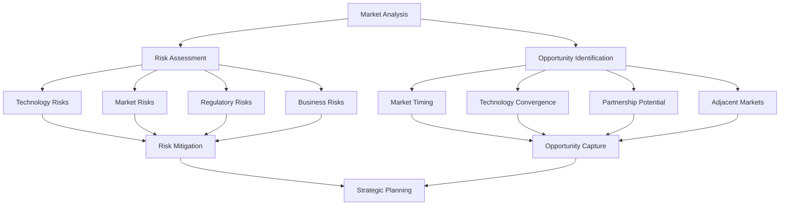
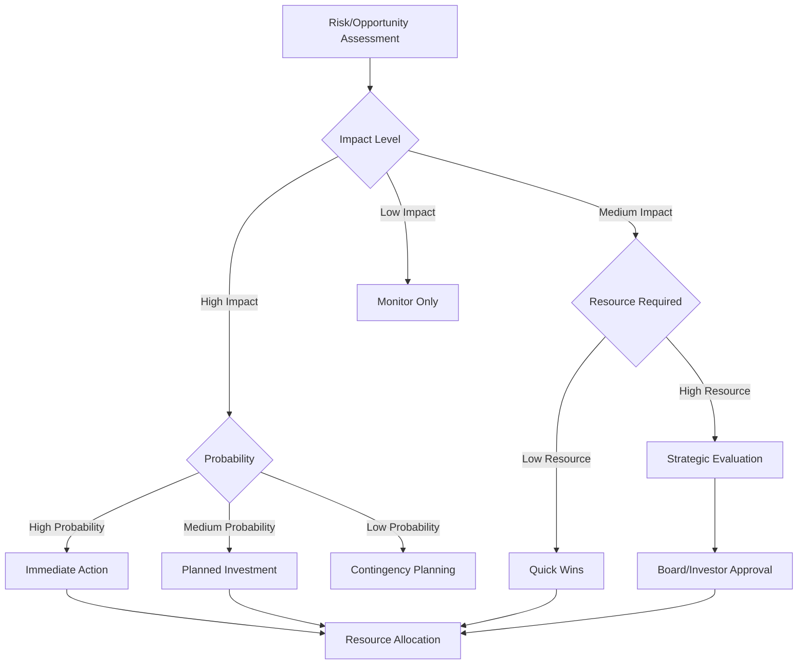

# Risk & Opportunity Analysis

## Executive Summary

This document provides a comprehensive analysis of risks and opportunities for the Ploy blockchain loyalty platform. The analysis examines market dynamics, competitive threats, technological challenges, regulatory considerations, and strategic opportunities that could significantly impact platform success and market positioning.

## 🎯 Strategic Context

### Market Position Assessment

The blockchain loyalty market represents a $24B+ opportunity with several key dynamics:
- **Market Maturity**: Early adoption phase transitioning to mainstream
- **Competition Level**: Moderate with potential for big tech disruption
- **Technology Readiness**: Infrastructure mature, user experience improving
- **Regulatory Environment**: Evolving but becoming clearer

### Risk-Opportunity Framework



---

## ⚠️ Risk Analysis

### 1. Technology Risks

#### Critical Infrastructure Dependencies
```yaml
blockchain_infrastructure_risks:
  network_failures:
    risk: "Blockchain network outages or performance degradation"
    probability: "Medium (15-25%)"
    impact: "High ($1M+ revenue impact)"
    example_scenarios:
      - ethereum_congestion: "High gas fees making transactions uneconomical"
      - solana_outages: "Network downtime affecting transaction processing"
      - sui_scalability: "Performance issues under high load"
    
    mitigation_strategies:
      immediate:
        - multi_chain_deployment: "Deploy on 5+ blockchain networks"
        - automatic_failover: "Switch chains during outages"
        - off_chain_backup: "Maintain Web2 fallback capabilities"
        - real_time_monitoring: "24/7 network health tracking"
      
      long_term:
        - chain_agnostic_architecture: "Easy migration between blockchains"
        - private_blockchain_option: "Enterprise-controlled networks"
        - hybrid_solutions: "Combine on-chain and off-chain processing"
```

#### Security and Smart Contract Risks
```typescript
interface SecurityRisks {
  smart_contract_vulnerabilities: {
    risk: "Exploits leading to fund loss or platform compromise",
    probability: "Medium (10-20%)",
    impact: "Critical ($10M+ potential loss)",
    
    attack_vectors: [
      "Reentrancy attacks on point redemption",
      "Integer overflow in reward calculations", 
      "Access control bypass in admin functions",
      "Flash loan attacks on token economics"
    ],
    
    mitigation_approach: {
      prevention: [
        "Multiple independent security audits",
        "Formal verification of critical contracts",
        "Bug bounty program with $100K+ rewards",
        "Gradual deployment with usage caps"
      ],
      
      response: [
        "Emergency pause mechanisms", 
        "Insurance coverage for smart contract risks",
        "Rapid response incident team",
        "Customer compensation fund"
      ]
    }
  },
  
  platform_security_risks: {
    risk: "Traditional cybersecurity breaches of platform infrastructure",
    probability: "High (30-40%)",
    impact: "High ($5M+ cost + reputation damage)",
    
    threat_categories: [
      "Customer data breaches",
      "Administrative system compromise",
      "API endpoint exploitation",
      "Social engineering attacks"
    ],
    
    mitigation_framework: {
      preventive_measures: [
        "SOC2 Type II compliance",
        "Penetration testing quarterly",
        "Employee security training",
        "Zero-trust architecture"
      ],
      
      detective_controls: [
        "24/7 security monitoring",
        "Anomaly detection systems",
        "Audit trail analysis",
        "Threat intelligence integration"
      ]
    }
  }
}
```

#### Scalability and Performance Challenges
```yaml
scalability_risks:
  transaction_throughput:
    current_limitations:
      - ethereum: "15 TPS base layer"
      - polygon: "7,000 TPS with occasional congestion"
      - solana: "65,000 TPS theoretical, outages in practice"
      - sui: "120,000 TPS claimed, unproven at scale"
    
    business_impact:
      - customer_experience: "Slow transaction confirmations"
      - cost_escalation: "High gas fees during congestion"
      - competitive_disadvantage: "Web2 alternatives perform better"
    
    mitigation_strategies:
      immediate:
        - layer_2_integration: "Polygon, Arbitrum, Optimism"
        - batch_processing: "Aggregate multiple operations"
        - intelligent_routing: "Use fastest available chain"
      
      advanced:
        - state_channels: "Off-chain transaction processing"
        - application_chains: "Dedicated blockchain networks"
        - hybrid_architecture: "Critical operations on-chain only"
  
  data_management:
    storage_costs: "On-chain storage extremely expensive"
    query_performance: "Blockchain data not optimized for analytics"
    data_availability: "Network outages affect data access"
    
    solutions:
      - ipfs_integration: "Distributed file storage"
      - indexing_services: "The Graph protocol integration"
      - data_lakes: "Traditional analytics infrastructure"
      - caching_layers: "Redis and CDN optimization"
```

### 2. Market and Competitive Risks

#### Big Tech Competition Threat
```typescript
interface CompetitiveThreats {
  big_tech_entry: {
    probability: "High (70-80%)",
    timeframe: "12-18 months",
    impact: "Critical (market disruption)",
    
    likely_entrants: {
      google: {
        advantages: ["Global reach", "Payment infrastructure", "AI capabilities"],
        entry_strategy: "Google Pay loyalty integration",
        threat_level: "Extreme"
      },
      
      amazon: {
        advantages: ["AWS infrastructure", "Prime ecosystem", "Retail expertise"],
        entry_strategy: "AWS blockchain service + Prime rewards",
        threat_level: "Very High"
      },
      
      microsoft: {
        advantages: ["Enterprise relationships", "Azure platform", "LinkedIn network"],
        entry_strategy: "Dynamics 365 loyalty module",
        threat_level: "High"
      },
      
      apple: {
        advantages: ["iOS ecosystem", "Apple Pay", "Privacy brand"],
        entry_strategy: "Wallet app loyalty integration",
        threat_level: "Medium"
      }
    },
    
    defensive_strategies: {
      first_mover_advantage: "Build network effects quickly (18-month window)",
      differentiation: "True decentralization vs. centralized alternatives",
      partnership_moats: "Exclusive integrations with key platforms",
      innovation_speed: "Monthly releases vs. annual big tech cycles",
      community_building: "Developer and user loyalty beyond features"
    }
  },
  
  web2_incumbent_adaptation: {
    threat: "Traditional loyalty providers adding blockchain features",
    examples: [
      "LoyaltyLion blockchain module",
      "Smile.io crypto rewards",
      "Yotpo NFT integration"
    ],
    probability: "Very High (90%+)",
    impact: "High",
    
    advantages_incumbents_have: [
      "Existing customer relationships",
      "Proven business models", 
      "Industry expertise",
      "Integration ecosystem"
    ],
    
    our_advantages: [
      "Blockchain-native architecture",
      "True decentralization benefits",
      "Lower total cost of ownership",
      "Web3 ecosystem integration"
    ]
  }
}
```

#### Market Adoption Challenges
```yaml
adoption_barriers:
  blockchain_skepticism:
    enterprise_concerns:
      - regulatory_uncertainty: "Unclear legal frameworks"
      - technical_complexity: "Perceived implementation difficulty"
      - security_fears: "High-profile hack headlines"
      - environmental_impact: "ESG compliance concerns"
      - cost_unpredictability: "Volatile gas fees"
    
    consumer_barriers:
      - wallet_complexity: "Private key management fear"
      - transaction_fees: "Paying to use rewards"
      - speed_expectations: "Instant gratification culture"
      - trust_issues: "Crypto association concerns"
    
    mitigation_approaches:
      enterprise_education:
        - executive_briefing_programs: "Blockchain literacy for C-suite"
        - proof_of_concept_projects: "Low-risk pilot implementations"
        - compliance_frameworks: "Ready-made regulatory compliance"
        - total_cost_analysis: "Web3 vs Web2 cost comparisons"
      
      consumer_experience:
        - invisible_blockchain: "Hide all technical complexity"
        - managed_wallets: "No private key management required"
        - gas_sponsorship: "Platform pays all transaction fees"
        - familiar_interfaces: "Web2-style user experience"
  
  economic_downturn_impact:
    recession_effects:
      - reduced_technology_spending: "IT budget cuts across industries"
      - loyalty_program_cuts: "Marketing budget reductions"
      - startup_funding_decline: "Venture capital availability"
      - customer_acquisition_costs: "Higher CAC in difficult markets"
    
    defensive_positioning:
      - roi_demonstration: "Clear cost savings and revenue increase"
      - recession_proof_value: "Customer retention more critical in downturns"
      - flexible_pricing: "Success-based and freemium models"
      - operational_efficiency: "Help customers reduce costs"
```

### 3. Regulatory and Compliance Risks

#### Global Regulatory Landscape
```typescript
interface RegulatoryRisks {
  data_privacy_regulations: {
    jurisdictions: {
      european_union: {
        regulation: "GDPR",
        requirements: [
          "Explicit consent for data processing",
          "Right to erasure (blockchain conflict)",
          "Data portability requirements",
          "Data protection officer mandates"
        ],
        penalties: "Up to 4% of global revenue",
        compliance_cost: "$500K-2M annually"
      },
      
      united_states: {
        regulations: ["CCPA", "CPRA", "State-specific laws"],
        requirements: [
          "Consumer data rights",
          "Opt-out mechanisms", 
          "Data breach notifications",
          "Third-party data sharing disclosure"
        ],
        penalties: "$2,500-7,500 per violation",
        compliance_cost: "$300K-1M annually"
      },
      
      other_regions: {
        canada: "PIPEDA requirements",
        brazil: "LGPD compliance",
        singapore: "PDPA obligations",
        australia: "Privacy Act amendments"
      }
    },
    
    blockchain_specific_challenges: {
      immutability_vs_erasure: "Cannot delete blockchain records",
      decentralization_vs_controllers: "Who is the data controller?",
      cross_border_transfers: "Data residency requirements",
      consent_management: "Complex permission structures"
    },
    
    compliance_strategy: {
      privacy_by_design: "Build compliance into architecture",
      legal_expertise: "Regulatory specialists on team",
      flexible_architecture: "Adaptable to new requirements",
      proactive_approach: "Exceed current standards"
    }
  },
  
  financial_services_regulation: {
    emerging_frameworks: {
      eu_mica: {
        timeline: "2024-2025 full implementation",
        requirements: [
          "Crypto asset service provider licensing",
          "Operational requirements compliance",
          "Customer protection measures",
          "Market abuse prevention"
        ],
        impact: "Significant compliance costs and operational changes"
      },
      
      us_regulatory_clarity: {
        agencies: ["SEC", "CFTC", "FinCEN", "OCC"],
        uncertainty_areas: [
          "Token classification (security vs utility)",
          "DeFi protocol regulation",
          "Cross-border transaction oversight",
          "Stablecoin requirements"
        ],
        strategy: "Conservative compliance approach"
      }
    },
    
    money_transmission_licensing: {
      requirement: "Needed if processing payments or holding funds",
      complexity: "State-by-state licensing in US",
      cost: "$50K-500K per jurisdiction",
      timeline: "6-18 months per license"
    }
  }
}
```

#### Blockchain-Specific Regulatory Evolution
```yaml
regulatory_uncertainty:
  token_classification:
    utility_vs_security:
      - utility_benefits: "Less regulatory overhead"
      - security_implications: "Full SEC compliance required"
      - classification_factors: "Investment contract analysis"
      - safe_harbor_possibilities: "Regulatory clarity initiatives"
    
    international_variations:
      - eu_approach: "MiCA framework definition"
      - singapore_model: "Payment services act coverage"
      - japan_standards: "Virtual currency regulations"
      - switzerland_guidelines: "FINMA token categories"
  
  dao_governance:
    legal_status_uncertainty: "No clear legal framework"
    liability_questions: "Who is responsible for DAO actions?"
    regulatory_compliance: "How to ensure DAO compliance?"
    taxation_implications: "Token holder tax obligations"
    
  cross_chain_compliance:
    jurisdiction_shopping: "Regulatory arbitrage concerns"
    enforcement_challenges: "Multi-jurisdictional operations"
    data_sovereignty: "Where is data legally located?"
    transaction_monitoring: "AML/KYC across chains"
```

### 4. Business Model and Financial Risks

#### Revenue Model Vulnerabilities
```typescript
interface BusinessModelRisks {
  customer_concentration: {
    risk: "Over-dependence on large customers",
    threshold: ">20% revenue from single customer",
    current_status: "Not yet at risk",
    
    scenarios: {
      enterprise_dependency: "Major enterprise customer churns",
      platform_dependency: "Integration partner changes terms",
      geographic_dependency: "Regulation changes in major market"
    },
    
    mitigation_strategies: {
      diversification: "Balanced customer portfolio across segments",
      contract_terms: "Long-term agreements with penalties",
      expansion_focus: "Grow revenue within existing accounts",
      pipeline_management: "3x pipeline to revenue ratio"
    }
  },
  
  pricing_pressure: {
    drivers: [
      "Competitive price wars",
      "Customer sophistication increase",
      "Economic downturn budget pressure",
      "Alternative solution emergence"
    ],
    
    impact_assessment: {
      margin_compression: "20-30% potential reduction",
      growth_rate_impact: "Slower customer acquisition",
      investor_perception: "Valuation multiple compression"
    },
    
    defensive_measures: {
      value_differentiation: "Focus on unique blockchain benefits",
      operational_efficiency: "Cost structure optimization",
      premium_positioning: "Enterprise features justify pricing",
      bundle_strategy: "Integrated platform approach"
    }
  },
  
  market_timing_risks: {
    too_early_scenario: {
      probability: "20%",
      indicators: "Slow enterprise blockchain adoption",
      impact: "Extended runway required, lower growth",
      response: "Focus on early adopters, reduce burn rate"
    },
    
    too_late_scenario: {
      probability: "30%", 
      indicators: "Big tech already dominating",
      impact: "Competitive disadvantage, higher CAC",
      response: "Niche positioning, acquisition target"
    }
  }
}
```

#### Funding and Capital Structure Risks
```yaml
capital_risks:
  crypto_market_volatility:
    correlation_risk: "Platform value tied to crypto sentiment"
    funding_impact: "Token-based fundraising challenges"
    customer_confidence: "Blockchain skepticism during downturns"
    employee_motivation: "Equity value fluctuations"
    
    hedging_strategies:
      - diversified_funding: "Traditional VC + revenue-based financing"
      - stablecoin_operations: "Reduce crypto exposure"
      - strong_fundamentals: "Focus on unit economics"
      - communication_strategy: "Educate on long-term value"
  
  burn_rate_management:
    runway_scenarios:
      optimistic: "30 months at current burn"
      realistic: "18 months with growth investments"
      pessimistic: "12 months with market challenges"
    
    funding_requirements:
      next_round_size: "$25-50M Series B"
      timing_flexibility: "6-month window for optimal terms"
      milestone_gates: "Revenue and customer targets"
      strategic_options: "Acquisition vs IPO path"
    
    cost_optimization:
      variable_costs: "Scale team with revenue growth"
      infrastructure_efficiency: "Cloud optimization and automation"
      partnership_leverage: "Reduce customer acquisition costs"
      milestone_budgeting: "Stage investments based on progress"
```

---

## 🌟 Opportunity Analysis

### 1. Market Timing Advantages

#### Web3 Adoption Inflection Point
```yaml
market_timing_opportunities:
  enterprise_blockchain_maturity:
    current_state: "Early adopter phase ending (crossing chasm)"
    next_phase: "Early majority adoption beginning"
    timing_window: "18-24 month opportunity"
    
    market_indicators:
      - infrastructure_maturity: "Better tooling and developer experience"
      - talent_availability: "More experienced blockchain developers"
      - regulatory_clarity: "Frameworks becoming clearer globally"
      - cost_efficiency: "Layer 2 solutions reducing transaction costs"
    
    competitive_advantages:
      - reduced_education_needed: "Market awareness significantly higher"
      - proven_use_cases: "Other blockchain applications demonstrating value"
      - infrastructure_ready: "Enterprise-grade solutions available"
      - risk_tolerance: "Businesses more comfortable with blockchain"
  
  post_pandemic_digital_acceleration:
    permanent_shifts:
      - digital_first_mindset: "Remote work normalizing digital solutions"
      - contactless_preferences: "Reduced physical interaction expectations"
      - data_driven_decisions: "Analytics and insights critical for survival"
      - customer_experience_focus: "Differentiation through experience"
    
    loyalty_program_importance:
      - customer_acquisition_costs: "Rising 20-30% annually"
      - retention_value: "5x cheaper than acquisition"
      - lifetime_value_focus: "Subscription economy growth"
      - personalization_demand: "Customers expect tailored experiences"
```

#### Economic Environment Benefits
```typescript
interface EconomicOpportunities {
  recession_advantages: {
    customer_retention_prioritization: {
      driver: "Customer acquisition costs rising faster than retention costs",
      opportunity: "Loyalty becomes strategic priority vs nice-to-have",
      market_size: "$6B additional spending on retention tools",
      positioning: "Ploy as essential revenue protection tool"
    },
    
    technology_consolidation: {
      driver: "Businesses evaluating vendor relationships for value",
      opportunity: "Replace multiple point solutions with unified platform",
      cost_savings: "30-50% reduction vs multiple vendors",
      competitive_advantage: "All-in-one vs best-of-breed fatigue"
    },
    
    innovation_investment_concentration: {
      driver: "Limited budgets force focus on highest-impact projects",
      opportunity: "Blockchain loyalty as transformation initiative",
      funding_priority: "C-suite digital transformation budgets",
      strategic_positioning: "Future-proofing business models"
    }
  },
  
  inflation_hedge_positioning: {
    token_value_preservation: "Loyalty points maintain purchasing power",
    international_expansion: "Cross-border value without currency risk",
    automated_adjustments: "Smart contracts handle inflation compensation",
    competitive_differentiation: "Traditional programs lose value in inflation"
  }
}
```

### 2. Technology Convergence Opportunities

#### AI and Blockchain Synergy
```yaml
convergence_advantages:
  ai_enhanced_personalization:
    market_opportunity: "$31B personalization market by 2025"
    unique_value_proposition: "Verifiable AI recommendations on blockchain"
    competitive_moat: "Transparent algorithmic decision making"
    
    implementation_advantages:
      - trust_layer: "Blockchain verifies AI isn't biased or manipulated"
      - data_sovereignty: "Customers own their AI training data"
      - cross_platform_learning: "AI insights portable between businesses"
      - algorithm_transparency: "Explainable AI with audit trails"
    
    revenue_opportunities:
      - premium_pricing: "AI features command 30-50% price premium"
      - data_monetization: "Anonymized insights marketplace"
      - algorithm_licensing: "White-label AI personalization"
  
  autonomous_loyalty_management:
    efficiency_gains: "80% reduction in manual program optimization"
    performance_improvement: "15-25% better results than human management"
    scalability_benefits: "Manage unlimited programs with same resources"
    
    market_differentiation:
      - self_optimizing_programs: "Continuously improving without human intervention"
      - real_time_adaptation: "Instant response to market changes"
      - predictive_interventions: "Prevent churn before it happens"
      - outcome_guarantees: "AI-driven performance commitments"
  
  predictive_customer_intelligence:
    market_gap: "Traditional analytics lack transparency and portability"
    blockchain_advantage: "Immutable customer behavior records"
    ai_enhancement: "Machine learning on verified data"
    
    monetization_potential:
      - subscription_tiers: "Basic, advanced, and predictive analytics"
      - insights_marketplace: "Sell aggregated industry benchmarks"
      - consulting_services: "AI-powered business optimization"
```

#### Metaverse and Digital Ownership Evolution
```typescript
interface MetaverseOpportunities {
  virtual_world_integration: {
    market_timing: "Metaverse adoption accelerating (Reality Labs $13B investment)",
    first_mover_advantage: "Build loyalty infrastructure before competitors",
    unique_positioning: "NFT-native loyalty platform ready for virtual worlds",
    
    implementation_opportunities: [
      "Virtual store loyalty experiences",
      "Cross-reality point earning and redemption", 
      "Immersive brand engagement campaigns",
      "Digital asset rewards and collectibles"
    ],
    
    revenue_models: {
      virtual_experience_fees: "Charge brands for metaverse loyalty activations",
      digital_asset_commissions: "Transaction fees on virtual goods",
      virtual_real_estate: "Loyalty point redemption for metaverse land",
      cross_reality_services: "Bridge physical and digital experiences"
    }
  },
  
  digital_ownership_trend: {
    consumer_demand: "Gen Z expects to own digital assets",
    regulatory_support: "Right to digital property emerging in legislation",
    technology_readiness: "NFT infrastructure mature and gas-efficient",
    
    business_opportunities: {
      premium_positioning: "True ownership vs traditional point systems",
      new_revenue_streams: "Transaction fees on loyalty asset trading",
      brand_partnerships: "Limited edition digital collectibles",
      community_building: "NFT holder exclusive experiences"
    }
  },
  
  web3_gaming_integration: {
    market_size: "$180B gaming industry + blockchain integration",
    cross_game_asset_utility: "Loyalty NFTs work across gaming platforms",
    play_to_earn_synergy: "Gaming rewards integrate with loyalty programs",
    
    strategic_partnerships: {
      gaming_platforms: "Epic Games, Steam, mobile gaming networks",
      nft_marketplaces: "OpenSea, LooksRare, platform-specific marketplaces",
      game_developers: "Indie studios building Web3-native games"
    }
  }
}
```

### 3. Strategic Partnership Opportunities

#### Cloud Provider Alliance Potential
```yaml
partnership_opportunities:
  amazon_web_services:
    mutual_benefits:
      aws_gains: "Enterprise blockchain use case demonstration"
      ploy_gains: "Credibility, infrastructure, enterprise sales channel"
    
    collaboration_opportunities:
      - aws_marketplace: "Featured blockchain loyalty solution"
      - joint_go_to_market: "Co-selling to enterprise customers"
      - infrastructure_optimization: "Native AWS integration"
      - innovation_partnership: "Next-gen blockchain services"
    
    implementation_strategy:
      phase_1: "AWS Marketplace listing and certification"
      phase_2: "Joint customer success stories and case studies"
      phase_3: "Integrated product offering and co-marketing"
      phase_4: "Strategic partnership or acquisition discussions"
  
  microsoft_azure:
    strategic_advantages:
      - dynamics_365_integration: "Native CRM and ERP connectivity"
      - teams_collaboration: "Loyalty management within Teams"
      - power_platform: "Low-code loyalty workflow builder"
      - azure_blockchain: "Preferred application on Azure blockchain service"
    
    enterprise_market_access:
      - existing_relationships: "Microsoft's enterprise customer base"
      - trust_factor: "Microsoft brand endorsement"
      - integration_ecosystem: "Office 365 and business application suite"
      - global_reach: "International market penetration"
  
  google_cloud:
    ai_ml_synergies:
      - vertex_ai_integration: "Enhanced personalization capabilities"
      - bigquery_analytics: "Advanced loyalty program analytics"
      - workspace_integration: "Business user adoption tools"
      - payment_ecosystem: "Google Pay and commerce integration"
```

#### Financial Technology Ecosystem
```typescript
interface FintechPartnerships {
  payment_processor_integration: {
    stripe: {
      opportunity: "Embedded loyalty in payment flows",
      technical_integration: "Native checkout reward experiences",
      market_expansion: "Access to millions of merchants",
      revenue_model: "Revenue share on transaction volume"
    },
    
    square: {
      opportunity: "POS-integrated loyalty for SMBs",
      ecosystem_access: "Square's merchant network",
      differentiation: "Blockchain features vs basic loyalty",
      expansion_potential: "International markets through Square"
    },
    
    paypal: {
      opportunity: "Digital wallet loyalty integration",
      scale_potential: "400M+ active user accounts",
      cross_border_benefits: "International loyalty programs",
      competitive_positioning: "Alternative to Apple/Google Pay"
    }
  },
  
  financial_data_partnerships: {
    plaid: {
      value_creation: "Spending pattern-based loyalty rewards",
      differentiation: "Banking data enhanced personalization",
      privacy_benefits: "Blockchain-verified financial insights",
      new_use_cases: "Predictive loyalty based on financial behavior"
    },
    
    fintech_platforms: {
      opportunities: ["Embedded finance loyalty", "Banking-as-a-service integration"],
      target_partners: ["Synapse", "Bond", "Treasury Prime"],
      value_proposition: "Native loyalty in financial products"
    }
  }
}
```

### 4. Adjacent Market Expansion Opportunities

#### Horizontal Market Extensions
```yaml
adjacent_markets:
  employee_engagement_platform:
    market_size: "$13.2B HR technology market"
    overlap_synergy: "Similar mechanics to customer loyalty"
    competitive_advantage: "Blockchain-verified achievements and recognition"
    
    implementation_approach:
      - existing_customer_upsell: "Sell to current B2B customers"
      - hr_tech_partnerships: "Integrate with Workday, BambooHR"
      - employee_nft_achievements: "Verifiable professional credentials"
      - cross_company_portability: "Professional reputation on blockchain"
    
    revenue_potential:
      - subscription_model: "$50-200 per employee annually"
      - enterprise_deals: "$500K-2M+ for large organizations"
      - certification_marketplace: "Professional development ecosystem"
  
  partner_channel_management:
    market_size: "$8.4B partner relationship management market"
    natural_evolution: "B2B loyalty programs for channel partners"
    blockchain_benefits: "Transparent incentive tracking and payments"
    
    target_customers:
      - software_vendors: "Channel partner incentive programs"
      - manufacturing: "Distributor and reseller loyalty"
      - professional_services: "Referral partner management"
    
    competitive_advantages:
      - smart_contract_automation: "Automatic partner payouts"
      - fraud_prevention: "Blockchain-verified partner activities"
      - cross_border_efficiency: "International partner programs"
  
  customer_data_platform_evolution:
    market_size: "$5.3B CDP market growing to $22B by 2025"
    positioning: "Blockchain-native customer data platform"
    differentiation: "Customer-owned data with business insights"
    
    value_propositions:
      - privacy_compliance: "Built-in consent management"
      - data_portability: "Customer-controlled data sharing"
      - verified_insights: "Blockchain-verified customer behavior"
      - cross_platform_identity: "Universal customer profiles"
```

#### Vertical Integration Strategies
```typescript
interface VerticalIntegration {
  pos_system_acquisition: {
    rationale: "Control entire point-of-sale loyalty experience",
    target_profile: "Mid-market POS companies with loyal customer base",
    synergies: [
      "Native blockchain loyalty features",
      "Differentiated POS offering",
      "Recurring hardware + software revenue",
      "Direct merchant relationships"
    ],
    
    acquisition_criteria: {
      revenue_range: "$10-50M annually",
      customer_base: "1,000-10,000 merchants",
      technology_stack: "Modern, API-first architecture",
      market_position: "Strong regional or vertical presence"
    }
  },
  
  analytics_platform_development: {
    opportunity: "Maximize value of blockchain loyalty data",
    competitive_advantage: "Verified, immutable customer behavior data",
    market_positioning: "Premium insights tier beyond basic loyalty",
    
    product_evolution: {
      basic_analytics: "Standard reporting included in platform",
      advanced_insights: "AI-powered predictive analytics ($50K+ annually)",
      industry_benchmarks: "Aggregated sector performance data",
      custom_research: "Bespoke market research services"
    }
  },
  
  payment_processing_entry: {
    strategic_rationale: "Capture payment + loyalty value chain",
    market_opportunity: "$200B+ payment processing market",
    blockchain_differentiation: "Instant loyalty point earning at payment",
    
    entry_strategies: {
      partnership_first: "White-label payment processing partnerships",
      acquisition_target: "Regional payment processors with crypto expertise",
      organic_development: "Build payment rails on blockchain infrastructure",
      regulatory_pathway: "Obtain money transmission licenses"
    }
  }
}
```

---

## 📊 Risk-Opportunity Assessment Matrix

### Quantitative Impact Analysis

#### High-Impact Opportunities (>$10M+ potential value)
```yaml
tier_1_opportunities:
  ai_integration_premium:
    market_size: "$31B personalization market"
    capture_potential: "5-10% market share possible"
    revenue_impact: "$1.5-3B potential"
    investment_required: "$50-100M"
    timeline: "18-24 months"
    probability: "High (70%)"
  
  enterprise_market_penetration:
    market_size: "$24B loyalty management market"
    capture_potential: "10-20% of enterprise segment"
    revenue_impact: "$2.4-4.8B potential"
    investment_required: "$100-200M"
    timeline: "24-36 months" 
    probability: "Medium (50%)"
  
  metaverse_first_mover:
    market_size: "$800B metaverse economy (projected 2030)"
    capture_potential: "1-2% loyalty segment"
    revenue_impact: "$8-16B potential"
    investment_required: "$25-50M"
    timeline: "12-18 months"
    probability: "Medium (40%)"
```

#### Critical Risk Mitigation Priorities (>$5M+ potential loss)
```typescript
interface CriticalRisks {
  big_tech_competition: {
    potential_impact: "$50-100M+ market opportunity loss",
    mitigation_cost: "$25-50M in competitive positioning",
    timeline: "Immediate (next 12 months)",
    strategy: "Accelerated feature development + partnership moats"
  },
  
  regulatory_compliance_failure: {
    potential_impact: "$10-50M in fines + market access loss",
    mitigation_cost: "$5-10M in compliance infrastructure",
    timeline: "Ongoing (next 24 months)",
    strategy: "Proactive compliance + legal expertise"
  },
  
  security_breach_incident: {
    potential_impact: "$20-100M in damages + reputation loss",
    mitigation_cost: "$2-5M in security infrastructure",
    timeline: "Ongoing risk",
    strategy: "Multi-layered security + insurance coverage"
  }
}
```

### Strategic Decision Framework

#### Investment Priority Matrix


#### Resource Allocation Recommendations
```yaml
immediate_priorities:
  risk_mitigation:
    security_infrastructure: "$3M investment (Q1)"
    regulatory_compliance: "$2M investment (Q1-Q2)"
    competitive_differentiation: "$5M investment (Q1-Q3)"
    
  opportunity_capture:
    ai_integration_development: "$8M investment (Q1-Q4)"
    enterprise_sales_scaling: "$10M investment (Q1-Q2)"
    strategic_partnership_development: "$2M investment (Q1-Q2)"

medium_term_investments:
  market_expansion:
    geographic_expansion: "$15M investment (Year 2)"
    adjacent_market_entry: "$10M investment (Year 2)"
    metaverse_positioning: "$5M investment (Year 2)"
    
  technology_advancement:
    platform_evolution: "$20M investment (Year 2-3)"
    acquisition_opportunities: "$50-100M (Year 2-3)"
    research_development: "$10M investment (Year 2-3)"
```

---

## 🎯 Strategic Recommendations

### Immediate Action Plan (0-6 months)

#### Risk Mitigation Priorities
```typescript
interface ImmediateActions {
  security_hardening: {
    actions: [
      "Complete third-party security audit",
      "Implement multi-signature wallet architecture",
      "Deploy automated monitoring and alerting",
      "Establish incident response procedures"
    ],
    investment: "$1.5M",
    timeline: "90 days",
    success_metrics: "Zero critical vulnerabilities, SOC2 certification"
  },
  
  regulatory_preparation: {
    actions: [
      "Hire regulatory counsel and compliance officer",
      "Implement GDPR/CCPA compliance framework", 
      "Develop token classification documentation",
      "Create regulatory change monitoring system"
    ],
    investment: "$800K",
    timeline: "120 days",
    success_metrics: "Compliance certification, legal opinion letters"
  },
  
  competitive_positioning: {
    actions: [
      "Accelerate AI integration development",
      "Secure strategic partnership MOUs",
      "Launch enterprise-grade features",
      "Establish thought leadership program"
    ],
    investment: "$2M",
    timeline: "180 days", 
    success_metrics: "Feature parity + differentiation, partner announcements"
  }
}
```

#### Opportunity Capture Initiatives
```yaml
high_priority_opportunities:
  enterprise_market_entry:
    - hire_enterprise_sales_team: "$1.5M investment"
    - develop_enterprise_features: "$3M investment"
    - establish_partner_channel: "$500K investment"
    - create_reference_customers: "$200K investment"
    
  ai_integration_launch:
    - hire_ai_ml_team: "$2M investment"
    - develop_personalization_engine: "$1.5M investment"
    - create_predictive_analytics: "$1M investment"
    - build_autonomous_optimization: "$500K investment"
    
  strategic_partnerships:
    - cloud_provider_relationships: "$300K investment"
    - fintech_ecosystem_integration: "$500K investment"
    - enterprise_software_partnerships: "$200K investment"
    - industry_consortium_leadership: "$100K investment"
```

### Medium-Term Strategy (6-18 months)

#### Market Expansion Plan
```typescript
interface MarketExpansion {
  geographic_growth: {
    european_market_entry: {
      investment: "$5M",
      timeline: "12 months",
      requirements: ["GDPR compliance", "Local partnerships", "Regulatory approval"],
      opportunity: "$500M+ addressable market"
    },
    
    asian_market_exploration: {
      investment: "$3M",
      timeline: "18 months", 
      requirements: ["Local compliance", "Cultural adaptation", "Partnership strategy"],
      opportunity: "$300M+ addressable market"
    }
  },
  
  vertical_expansion: {
    healthcare_specialization: {
      investment: "$2M",
      timeline: "9 months",
      requirements: ["HIPAA compliance", "Medical partnerships", "Clinical validation"],
      opportunity: "$50B+ healthcare technology market"
    },
    
    financial_services_focus: {
      investment: "$3M", 
      timeline: "12 months",
      requirements: ["Financial licensing", "Banking partnerships", "Regulatory approval"],
      opportunity: "$100B+ fintech market"
    }
  }
}
```

### Long-Term Vision (18+ months)

#### Strategic Positioning Goals
```yaml
market_leadership_objectives:
  dominant_market_position:
    - market_share: "20%+ of blockchain loyalty market"
    - brand_recognition: "Top-of-mind for enterprise blockchain loyalty"
    - thought_leadership: "Industry standard setter and protocol definer"
    
  technology_innovation:
    - ai_advancement: "Autonomous loyalty optimization leader"
    - web3_integration: "Complete metaverse and DeFi ecosystem"
    - blockchain_evolution: "Multi-chain and quantum-resistant platform"
    
  business_scale:
    - revenue_target: "$500M+ annual recurring revenue"
    - customer_base: "100,000+ business customers globally"
    - geographic_presence: "Operations in 20+ countries"
    - team_scale: "2,000+ employees worldwide"

exit_strategy_optionality:
  ipo_preparation:
    - revenue_scale: "$200M+ ARR with 40%+ growth"
    - market_conditions: "Favorable blockchain/SaaS valuations"
    - regulatory_clarity: "Clear blockchain business frameworks"
    
  strategic_acquisition:
    - acquirer_categories: ["Big tech", "Enterprise software", "Payment companies"]
    - valuation_range: "$5-20B based on market position"
    - integration_benefits: "Complementary technology and distribution"
```

---

## 🎯 Conclusion

### Risk-Adjusted Opportunity Assessment

The analysis reveals a **favorable risk-opportunity profile** for Ploy, with several key insights:

#### Positive Indicators
1. **Market Timing**: Web3 adoption curve entering mainstream phase
2. **Technology Readiness**: Infrastructure mature enough for enterprise adoption  
3. **Competitive Window**: 12-18 month advantage before big tech enters
4. **Multiple Expansion Paths**: Adjacent markets and geographic opportunities
5. **Defensive Moats**: Blockchain-native advantages difficult to replicate

#### Critical Success Factors
1. **Execution Speed**: Rapid development and market penetration essential
2. **Strategic Partnerships**: Credibility and distribution crucial for success
3. **Regulatory Proactivity**: Compliance leadership creates competitive advantage
4. **Technology Differentiation**: Clear blockchain benefits must be maintained
5. **Capital Efficiency**: Smart resource allocation across opportunities and risks

#### Investment Thesis Validation

The comprehensive analysis supports a **strong investment thesis** with:
- **Large addressable market** ($24B+ loyalty management)
- **Clear technology advantages** (blockchain transparency, AI integration)
- **Multiple monetization paths** (subscription, transaction, platform fees)
- **Defensive positioning** against competitive threats
- **Scalable business model** across segments and geographies

**Recommended Action**: Proceed with aggressive growth strategy while implementing comprehensive risk mitigation framework. The opportunity window justifies significant investment to capture market leadership position before competitive threats materialize.